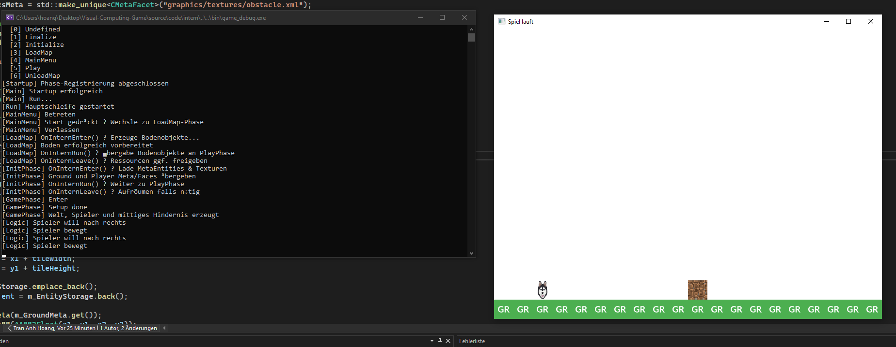
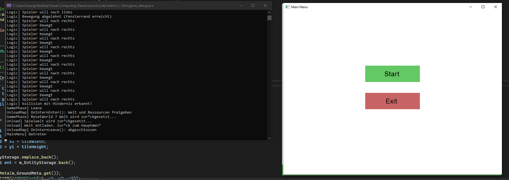

# 🎮 Visual Computing Game

Willkommen zum Visual Computing Projekt, entwickelt mit **Visual Studio 2022**.  
Dieses Spiel ist Teil einer Lehrveranstaltung im Bereich Visual Computing.

---

## 🛠️ Ausführungshinweis für Prof. Sahm

📌 *Das Spiel wurde ausschließlich im **Debug-Modus** entwickelt und getestet. Bitte stellen Sie sicher, dass alle Abhängigkeiten korrekt eingebunden sind, wenn die `.exe` ausgeführt wird. Local konnte ich es bei mir ausführen.*  

👉 [source/code/build/win64/game/Debug/game_debug.exe](source/code/build/win64/game/Debug/game_debug.exe)

Der **Release-Modus** wurde lediglich einmalig für einen kurzen Test kompiliert, jedoch nicht weiter verfolgt oder regelmäßig verwendet.  

---

## Sneak-Peak






---

## 📦 Abhängigkeiten

### 🔹 SFML (Simple and Fast Multimedia Library)
- SFML wird im Projekt verwendet, ist jedoch **nicht Teil dieses Repositories**.
- Die Bibliothek wurde **lokal eingebunden** und muss manuell heruntergeladen und verlinkt werden.
- Download: [SFML-2.5.1-windows-vc15-64-bit](https://www.sfml-dev.org/files/SFML-2.5.1-windows-vc15-64-bit.zip)

### 🔹 tinyxml2
- tinyxml2 wird für XML-Verarbeitung verwendet.
- Die Bibliothek wurde mittels **[vcpkg](https://github.com/microsoft/vcpkg)** eingebunden.
- Installationsbefehl (wenn vcpkg bereits eingerichtet ist):
  ```bash
  vcpkg install tinyxml2
---

## 🎯 Bugs

In dieser Sektion werden Probleme aufgeführt, die sich speziell auf Game beziehen.

---

### ❌ Logger-Linkerproblem

**Beschreibung:**  
Beim Aufruf von `Core::Logger::Log(...)` in der Game-Phase (`CPlayPhase::OnInternRun`) tritt ein Linkerfehler (`LNK2019`) auf. Die Methode ist zwar im Header deklariert, aber zur Link-Zeit nicht auffindbar.

**Ursache:**  
Die Datei `core_log.cpp` wird zwar kompiliert, aber das resultierende `core_debug.lib` wird vom `game`-Projekt nicht korrekt gefunden oder nicht vollständig eingebunden.

**Workaround:**  
Die Log-Zeile wurde aktuell auskommentiert:
```cpp
// Core::Logger::Log("Taste gedrückt: %d", rKeyEvent.m_KeyCode);
```

Im core-Projekt wurde ein grundlegendes Event-System (core_event_system) implementiert, das eigene Events wie CKeyPressedEvent oder CWindowCreatedEvent definiert und über einen Dispatcher (CEventDispatcher) weiterleiten kann.

Aktueller Stand:

Das System wird in der Spielphase bereits testweise verwendet, um SFML-Ereignisse (wie Tastendruck oder Fenster schließen) in interne Events zu übersetzen.

Event-Handler lassen sich über Subscribe(...) registrieren.

Die Logik zum Dispatch ist implementiert, wurde aber bisher nicht vollständig getestet.

### ❌ Spiel hängt nach Kollision beim Phasenwechsel

**Beschreibung:**  
Wenn der Spieler mit einem Hindernis kollidiert, wird korrekt die `Menu`-Phase ausgelöst. Jedoch ist die Benutzeroberfläche (UI) in dieser Phase anschließend **nicht mehr nutzbar** – das Spiel wirkt eingefroren oder hängt.

**Beobachtung:**  
Die UI wird zwar visuell angezeigt, aber Eingaben (z. B. Buttons) reagieren nicht mehr. Auch Rückkehr in andere Spielphasen ist nicht möglich.

**Mögliche Ursache:**  
Es ist wahrscheinlich, dass die `UnloadMap`-Phase **nicht vollständig alle Speicherbereiche und Zustände korrekt freigibt** oder neu initialisiert.  
Ein Test mit der `Initialize`-Phase als Ersatz führte ebenfalls nicht zum gewünschten Verhalten – die Probleme bleiben bestehen.

**Hypothese:**  
- Ressourcen wie Texturen, UI-Elemente oder interne State-Handler bleiben aktiv oder werden nicht richtig gelöscht
- Eventuell wird die Logik in der Menu-Phase **nicht erneut korrekt aufgebaut** (z. B. `m_pLogic` oder `m_pUI` nicht gesetzt)

**Verbesserungen (nicht geschafft):**

- Die `UnloadMap`-Phase auf korrekte Speicherfreigabe und Rücksetzung prüfen
- Sicherstellen, dass `Menu`-Phase ihre Abhängigkeiten (Speicher, Entities, GameState) frisch initialisiert

---

